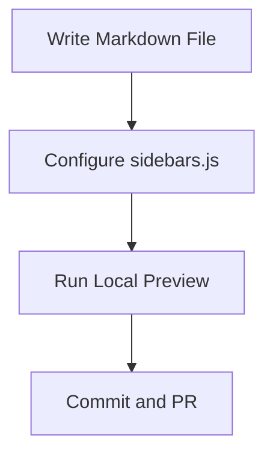
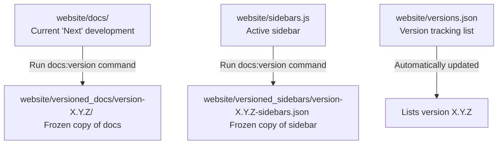

# Documentation & Versioning Guide

This guide is designed for contributors and maintainers. It covers how to add documentation pages, configure the sidebar, run the site locally, and manage versioning.

---

## 1. Adding and Editing Documentation

Documentation pages are written in **Markdown** or **MDX** (Markdown with JSX/React components support).

### File Structure

All documentation files reside in the `website/docs/` directory:
- `website/docs/user/`: User-facing manuals, installation instructions, and troubleshooting.
- `website/docs/technical/`: Architecture, module designs, repository details, and build/release processes.
- `website/docs/contributing/`: Contributor guidelines, standards, and workflow instructions.

### Creating a New Page

1. Create a new `.md` (or `.mdx`) file under the appropriate subdirectory of `website/docs/`.
2. Add the required frontmatter at the top of the file:

```markdown
---
id: documentation-guide
title: Documentation and Versioning Guide
sidebar_label: Documentation & Versioning
description: Short summary of what this page covers for SEO and search tools.
---
```

### Writing Content

Docusaurus supports standard Markdown, MDX, and several built-in interactive features:

#### Admonitions / Callouts
Use admonitions to highlight important tips, warnings, or notes:

```markdown
:::note
This is a standard informational note.
:::

:::tip
Use tips for helpful recommendations.
:::

:::warning
Warnings indicate potential pitfalls or actions that require caution.
:::
```

#### Mermaid Diagrams
Mermaid diagrams are fully supported in this project. You can write inline flowcharts or sequence diagrams:

```markdown

```

---

## 2. Configuring the Sidebar

The sidebar navigation structure is defined in `website/sidebars.js`.

### Adding a Page to the Sidebar

1. Open `website/sidebars.js`.
2. Locate the category where you want the new document to appear.
3. Add the relative path of your document (excluding the `website/docs/` prefix and `.md`/`.mdx` extension) to the items array.

For example, to add `website/docs/contributing/documentation-guide.md`:

```javascript
    {
      type: "category",
      label: "Contributor",
      items: [
        "contributing/getting-started",
        "contributing/pull-request-guidelines",
        "contributing/documentation-governance",
        "contributing/documentation-guide" // Added here
      ]
    }
```

---

## 3. Docusaurus Native Documentation Versioning

This project uses Docusaurus native documentation versioning to archive previous releases of the documentation. 

- **Next (Unreleased)** version: Corresponds to files in the active development branch. Source files are edited directly inside `website/docs/`.
- **Archived (Released)** versions: Historical versions of documentation. They are frozen and read-only unless specifically patched.

### The Versioning Lifecycle



### Cutting a New Version

When releasing a new version of the software (e.g., version `1.3.0`), freeze the current state of documentation:

1. Navigate to the `website` directory:
   ```bash
   cd website
   ```
2. Run the version command using the Docusaurus CLI via `npx`:
   ```bash
   npx docusaurus docs:version 1.3.0
   ```

### What Happens Behind the Scenes?

Running the version command creates the following structures:
- `website/versions.json`: The version tag `1.3.0` is prepended to the array.
- `website/versioned_docs/version-1.3.0/`: A copy of all files from `website/docs/` is stored here.
- `website/versioned_sidebars/version-1.3.0-sidebars.json`: A snapshot copy of `website/sidebars.js` is stored here.

### Modifying Versioned Docs

- **Updating the upcoming release (Next)**: Edit files in `website/docs/`.
- **Updating an already-released version (e.g., 1.2.9)**: Edit the corresponding file in `website/versioned_docs/version-1.2.9/`.

---

## 4. Local Development and Validation

Always run the site locally to preview your documentation changes before submitting a Pull Request.

### Setup and Start Preview

Run these commands inside the `website/` directory:

1. **Install dependencies**:
   ```bash
   npm install
   ```
2. **Start local development server**:
   ```bash
   npm run start
   ```
   The site will load automatically at `http://localhost:3000/`.

### Verifying and Building

Before committing, run a production build to check for broken links and configuration errors:

```bash
npm run build
```
Any broken internal links or invalid configurations will cause the build to fail, preventing deployment issues.
