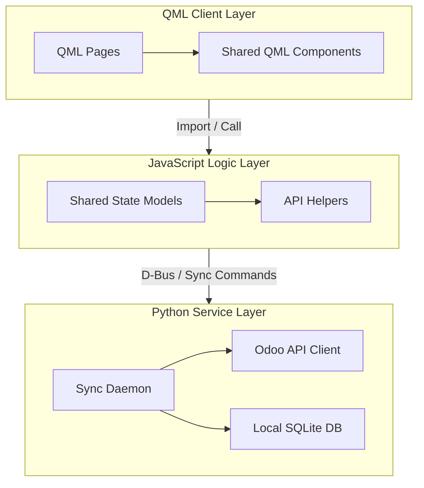

# Architecture Overview

TimeManagement is a desktop and Ubuntu Touch application composed from three main layers:

- QML for interface and app shell behavior
- JavaScript modules in `models/` for shared client-side state and helpers
- Python services in `src/` for backend, sync, daemon, configuration, and utility logic

## High-level flow

At a high level:

1. QML pages and components render the product interface.
2. Shared JavaScript modules support client-side state and feature logic.
3. Python modules handle backend operations, sync routines, and system-facing behavior.

## Key technical directories

- `qml/`: application UI, shared components, images, and feature pages
- `models/`: JavaScript modules imported into QML
- `src/`: Python backend and sync logic
- `assets/`: branding and package-level artwork
- `docs/`: source documentation kept in the main repository
- `website/`: Docusaurus-based website and documentation portal

## System Architecture Model

Here is the high-level representation of the TimeManagement three-layer architecture and component integration.

### Architectural Diagram

*Figure 1: Component layout and communication lines between UI, JavaScript models, and Python backend services.*

## Documentation intent

This technical section should answer:

- where code belongs
- how features are split across the stack
- how the project is built and packaged
- how contributors should reason about changes that span QML, JS, and Python
